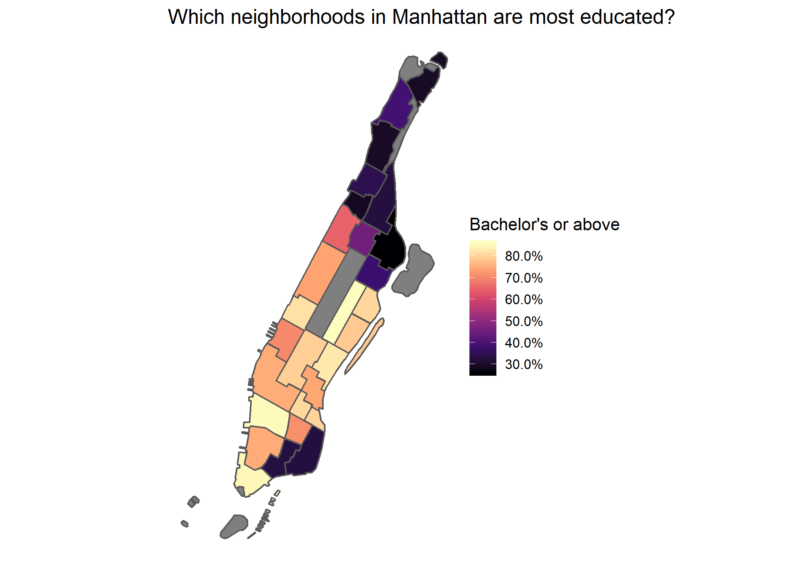

Introduction to R and RStudio
================
Matt Herman
1/25/2019

### The power of R

I think R is really neat, but there is an adjustment to working
primarily in code, instead of in Excel or SPSS. Once you get the hang of
it, you’ll be able to do really impressive and powerful things in an
efficient and reproducible way.

One brief example to get you excited — with just a few lines of code
you’ll be able to make maps like this:

``` r
library(tidyverse, quietly = TRUE)
## -- Attaching packages --------------------------------------------------- tidyverse 1.2.1 --
## v ggplot2 3.1.0     v purrr   0.3.0
## v tibble  2.0.1     v dplyr   0.8.0
## v tidyr   0.8.2     v stringr 1.3.1
## v readr   1.3.1     v forcats 0.3.0
## -- Conflicts ------------------------------------------------------ tidyverse_conflicts() --
## x dplyr::filter() masks stats::filter()
## x dplyr::lag()    masks stats::lag()
library(sf)
## Linking to GEOS 3.6.1, GDAL 2.2.3, PROJ 4.9.3
library(nycgeo)

mn_ntas <- nyc_boundaries(
  geography = "nta",
  filter_by = "borough",
  region = "manhattan",
  add_acs_data = TRUE
  )

ggplot(mn_ntas) +
  geom_sf(aes(fill = pop_ba_above_pct_est)) +
  scale_fill_viridis_c(
    name = "Bachelor's or above",
    labels = scales::percent_format(),
    option = "magma"
    ) +
  theme_void() +
  theme(panel.grid = element_line(color = "transparent")) +
  labs(title = "Which neighborhoods in Manhattan are most educated?")
```



### Getting Oriented

#### What’s the difference between R and RStudio?

  - R is a programming language
  - RStudio is a IDE (integrated development environment)
  - Most people use RStudio to interact with the R language

#### How R is different from Excel/SPSS

  - Code (no menus\!)
  - Think about objects and functions instead of one dataset
  - Reproducible
  - Free and open source
  - Thousands of add-on packages to do cool stuff
  - Large support and developer community

#### RStudio Panes

  - Console
  - Source
  - Environment
  - Help/Plots/Packages

#### What’s a(n)

  - Object
  - Vector
  - Data frame/tibble
  - List
  - Function
  - Package
  - Script

#### Data types

  - Character (text)
  - Numeric, integer, complex (numbers)
  - Logical (true/false)
  - Factor (categorical)
  - Vectors and columns of data frames can only be a single data type\!

#### Things you’ll see a lot when using R

  - `c()` \[concatenate/combine\]
  - `<-` \[assignment operator\]
  - `=` \[equal/assign\]
  - `==` \[is equal to/comparison\]
  - `#` \[comment/don’t run\]
  - `%>%` \[pipe\]
  - `NA` \[missing data\]

### Reading in/out data

#### .csv, .tsv

``` r
library(readr)
my_df <- read_csv("/mydirec/myfile.csv")
write_csv(my_df, "/mydirec/myfile.csv")
```

#### xls, xlsx

``` r
library(readxl)
my_df_2 <- read_excel("/mydirec/myfile.xlsx")
library(writexl)
write_xlsx(my_df_2, "/mydirec/myfile.xlsx")
```

#### shp, geojson, kml (pretty much any spatial data\!)

``` r
library("sf")
my_sf <- read_sf("/mydirec/myshp.shp")
write_sf(my_sf, "/mydirec/myshp.shp")
```

### Packages

#### Install new package

``` r
install.packages("tidyverse")
```

#### Load package

``` r
library(tidyverse)
```

#### Some important packages you should know about

##### tidyverse

  - `dplyr` (data manipulation)
  - `readr` (data import/export)
  - `ggplot2` (data visualization)
  - `tidyr` (data reshaping)
  - `stringr` (working with text)
  - `lubridate` (working with dates)
  - `forcats` (working with categorical data)

##### Accessing Census data

  - `tidycensus` (download data from US Census API)
  - `tigris` (download TIGER/Line shapefiles from US Census)

##### Mapping

  - `sf`
  - `tmap`
  - `mapview`
  - `leaflet`

#### Where to find help

  - `?function_name`
  - Package vignettes
  - [R for Data Science](https://r4ds.had.co.nz)
  - [RStudio
    Cheatsheets](https://www.rstudio.com/resources/cheatsheets/)
  - [RStudio Community](http://community.rstudio.com)
  - [Stack Overflow](https://stackoverflow.com/questions/tagged/r)
  - \#rstats
  - DataCamp
